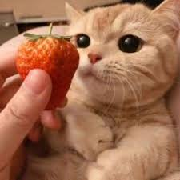
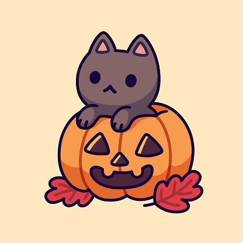

```{r setup, include=FALSE}
knitr::opts_chunk$set(echo = TRUE)
knitr::opts_chunk$set(fig.width=8, fig.height=5, fig.align = "center") 
```

```{r}
# Before we begin, let's set the seed to be a student number so it produces the same result
# every time.
set.seed(1004079631)
```

This vignette covers the process of using $4$ functions in <span style="color:blue">functions.R</span>, `process_image()`, `scree_plot()`, `colour_strips()`, `make_pattern()` to generate a cross-stitch of a given image.

For demonstrating purpose, the image that we will use to generate the cross-stitch is the following:
<center></center>

We need the following library packages to run the functions, make sure you have installed them!
```{r, message = FALSE, warning = FALSE}
# This also checks if the required libraries are installed while loading the functions.
# If not, please follow the return error message and install the required libraries.
source("functions.R")
# load the libraries that we need, should be installed at this stage by previous check
library(imager)
library(tidyverse)
library(tidymodels)
library(sp)
library(scales)
library(cowplot)
library(dmc)
```

The first step is to use `process_image()` function to perform clustering on the image data by stating the argument `k_list`, a list of possible number of clusters that you want to try for the image given at a filepath by inputting the name of the image for `image_file_name` argument. Let's try to compute a k-means clustering with $1-10$ as the potential cluster number.
```{r echo=TRUE, message=FALSE, warning=FALSE}
# let's try to compute a k-means clustering with the 1-10 clusters as the candidates
cluster_info <- process_image(image_file_name = "cat.jpg", k_list = c(1:10))
```

The output `cluster_info` has many information. For example, `cluster_info$clusterings` return a summary of all the clusterings we have tried on the image data, such as the varaince for each number of clusterings.
```{r echo=TRUE, message=FALSE, warning=FALSE}
cluster_info$clusterings
```

`cluster_info[[k]]` returns two tibbles `dat` and `centres` for the $k$ number of clusters implemented on the image. `dat` is all the data points after clustered and tidied with RGB values, where `centres` tells us detailed information about each cluster, such as the colour `col` of the clusters and their closest dmc colours `hex` and the name `dmc`.
```{r echo=TRUE, message=FALSE, warning=FALSE}
# for example, k = 3
cluster_info[[3]]$dat
```

```{r echo=TRUE, message=FALSE, warning=FALSE}
# for example, k = 3
cluster_info[[3]]$centres
```

The second step for generating a cross-stitch pattern is to determine the number of clusters that we are actually using. To do so, we need to have a look at the scree plot of the k-clusterings for $1-10$ clusters of the image (using the function `scree_plot()`) to narrow down our candidates for the cluster number.
```{r, message = FALSE, warning = FALSE, out.width = '100%'}
scree_plot(cluster_info)
```

We can see that from the scree plot, the number of clusters should be $5$ or $6$ for the cat image, as the variance does not decrease as much after that number of clusters.

Let's have a look at the colour strips of the cluster centres for each cluster number to finalize the number of clusters that we will be using by the function `colour_strips()`.
```{r, message = FALSE, warning = FALSE, out.width = '100%'}
colour_strips(cluster_info)
```

I will choose to pick $6$ as the number of clusters since the colours are quite different (the orange is new for $6$ clusters, which is a very distinct colour from the colours of the $5$ clusters). This is more of a personal choice; it is quite challenging to actually pick the best number. I am only picking a reasonable number of clusters and I am uncertain that if this is the best pick.

After we have decided the number of clusters, let's get to the exiting part — to actually compute the cross-stitch pattern for the cat image! The function `make_pattern()` will take care of it for us, by inputting `cluster_info`, the chosen number of clusters `k = 6`, and the (approximate) total number of possible stitches in the horizontal direction `x_size` that you would like.
```{r, message = FALSE, warning = FALSE, out.width = '100%'}
# I picked x_size to be 50 for example
make_pattern(cluster_info, k = 6, x_size = 50)
```

If you are nearsighted like me, just take off your glasses and/or squeeze your eyes, you can see that the cross-stitch pattern that we generated is so similar to the original picture (with some imaginations). Let's load the original image again to compare.
<center></center>

We can also generate a cross-stitch that does not have the background colour stitched, for example, we can remove the "Dessert Sand - Very Dark (3772)" colour from our cat image by entering the string argument `background_colour` as the number id in the bracket of the colour in the legend, in this case, the string `"3772"`.
```{r message=FALSE, warning=FALSE, out.width = '100%'}
make_pattern(cluster_info, k = 6, x_size = 50, background_colour = "3772")
```

Moreover, if you are in the mood of creating a sketching style, we can make a black and white cross-stitch pattern by letting the argument `black_white` to be `TRUE`.
```{r, message = FALSE, warning = FALSE, out.width = '100%'}
source("functions.R")
make_pattern(cluster_info, k = 6, x_size = 50, black_white = TRUE)
```

Since this example cat image does not have a clear background colour, let's use another image to demonstrate the usage of argument `background_colour` better (in the spirit of Halloween, the new image is again a cat picture with pumpkin because you can tell by now that I am a cat person).
<center></center>

```{r echo=TRUE, message=FALSE, warning=FALSE, out.width = '100%'}
# let's try to compute a k-means clustering with the k_list clusters number candidate
# I eyeball that it should have at least 3 to 8 colours of clusters
k_list2 = c(3:8)
cluster_info2 <- process_image("pumpkin_cat.jpg", k_list2)
scree_plot(cluster_info2)
```

We can see that the number of clusters should be $5$ or $6$ from this new scree plot.

Let's have a look at the colour strips of the cluster centres to decide the number of clusters that we should use to make the cross-stitch pattern.
```{r, message = FALSE, warning = FALSE, out.width = '100%'}
colour_strips(cluster_info2)
```

I will pick $k = 5$ clusters since the added colours for $6$ clusters become similar colours of grey $(\#7F6A55, \#484848)$. Let's get to the exiting part again, to actually compute the cross-stitches pattern!
```{r, message = FALSE, warning = FALSE, out.width = '100%'}
make_pattern(cluster_info2, k = 5, x_size = 50)
```

We can clearly see that the tan colour is the background colour that we do not need to stitch (one can stitch onto a tan colour cloth, save themselves from stitching so many entries). Let's remove the background colour "Tan - Ultra Very Light (739)" colour from our pumpkin cat image by entering the argument `background_colour = "739"`, which is the number in the bracket in the legend as previously mentioned.

```{r, message = FALSE, warning = FALSE, out.width = '100%'}
make_pattern(cluster_info2, k = 6, x_size = 50, background_colour = "739")
```

Now we only have the pumpkin and the cat, no more stitches for the background.

This is the end of the tutorial for how to generate a cross-stitch pattern of a given image using the $4$ functions in <span style="color:blue">functions.R</span>. If you are curious why there's an extra function called `change_resolution()` in the <span style="color:blue">functions.R</span> file, it is because `make_pattern()` uses it to lower the quality of the image for a better performance of making stitching patterns.

I believe that you are an expert now on how to generate cross-stitch pattern for an image. It's time for you to start stitching! Enjoy :)